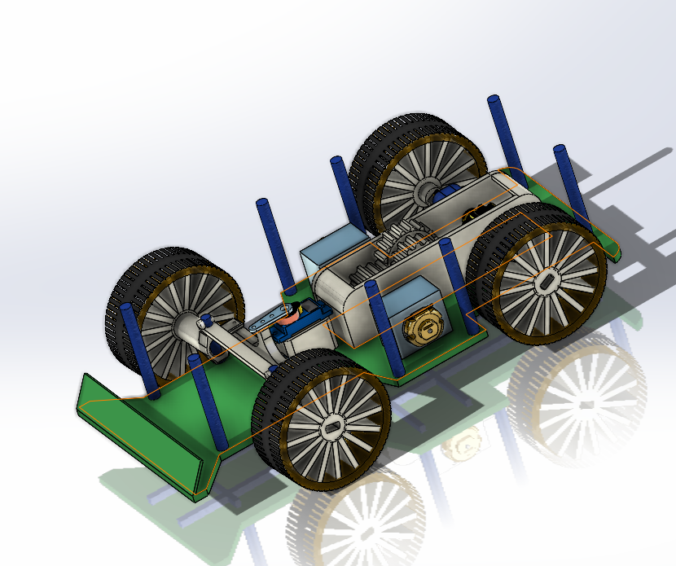

# 🚗 3D Printed RC Car Design  

 <!-- يمكنك رفع صورة من تصميمك وتغيير الاسم -->

## 📖 About the Project
This project is a **3D printed RC car design**, fully modeled from scratch using 3D CAD tools.  
It started as a summer learning project to practice 3D modeling, and it became my biggest and most complete design so far 🚀.

The goal of this design is to provide a working prototype framework for an RC car, focusing on:
- Mechanical structure (chassis & frame)
- Gearbox design for torque enhancement
- Steering mechanism integration
- Component fitting with proper tolerances for 3D printing and assembly  

---

## ⚙️ Features
- 🛠️ Fully designed from scratch (no templates used)  
- 🔩 Proper tolerances for **3D printing & assembly**  
- ⚡ Powered by **two DC motors (3V)** connected via a gearbox  
- 🎯 Steering controlled by a **servo motor**  
- 🚙 Rear-wheel drive system with synchronized front-wheel steering  

---

## 🖼️ Design Snapshots
Here are a few CAD renderings of the design:

  
  
  
  
  
  
  
  

---

## 🎓 Education
- **Name:** Ahmed Mohamed Attia  
- **University:** Zagazig University – Faculty of Engineering  
- **Specialization:** Communications & Electronics Engineering  
- **Year:** Going into 2nd year  

---

## 🌐 Find Me Online
- 📂 GitHub: [Ahm3d0x](https://github.com/Ahm3d0x)  
- 💼 LinkedIn: [Ahmed M. Attia](https://linkedin.com/in/ahmed-m-attia-757aa6292)  
- 📧 Email: [ahm3d.m.attia@gmail.com](mailto:ahm3d.m.attia@gmail.com)  

---

## 🤝 Contribution & Feedback
Feel free to check the design files, suggest improvements, or fork this repository!  
I’d love to hear your feedback and ideas 🌟.  

---

## 📜 License
This project is released under the **MIT License** – free to use, modify, and share.
